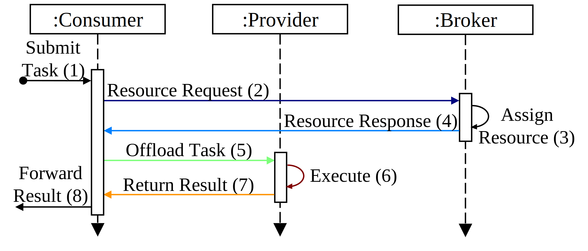

# Latency-Aware Scheduling for Real-Time Application Support in Edge Computing

This repository contains the outcomes and insights presented in the paper: **"Latency-Aware Scheduling for Real-Time Application Support in Edge Computing"**. We publish the data as a valuable reference for researchers, practitioners, and system designers for developing more authentic simulations that accurately replicate the performance of edge offloading in real-world situations.

## Structure

There is a folder for each [scheduling strategy (s1 - s5)](#scheduling-strategies). 

In each folder are `json` files which contain the RTTs of each peer (_RTTs != network times_). Each entry represents one time step per peer.

Also each folder has `csv` files. These contain the entire time steps in the [life cycle of a Tasklet](#tasklet-lifecycle). At the end of each line is the respective total network time. The columns each have a prefix (**_c**, **_b**, **_p**), indicating whether a value was measured at the consumer (**_c**), broker (**_b**), or provider (**_p**).

The [identity_map.json](identity_map.json) maps each identity to a human-readable descriptive label.

### Scheduling Strategies
|        | **Scheduling per Priority Class** |         |
|--------|:---------------------------------:|---------|
|        |         **High/Realtime**         | **Low** |
| **S1** | random                            | random  |
| **S2** | local_r < edge_r < cloud_d        | random  |
| **S3** | local_r < edge_r < cloud_d        | random  |
| **S4** | local_r < edge_r < cloud_d        | cloud_d |
| **S5** | local_r < edge_d < cloud_d        | cloud_d |

### Tasklet Lifecycle

